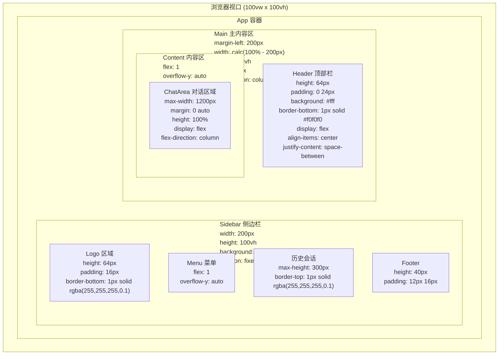
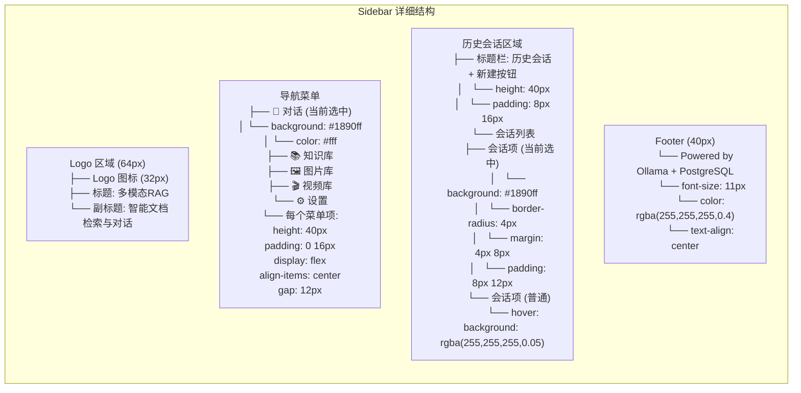
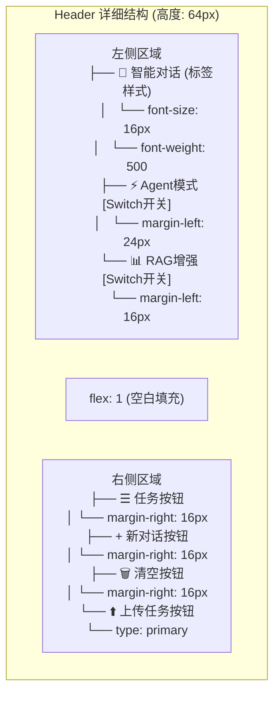
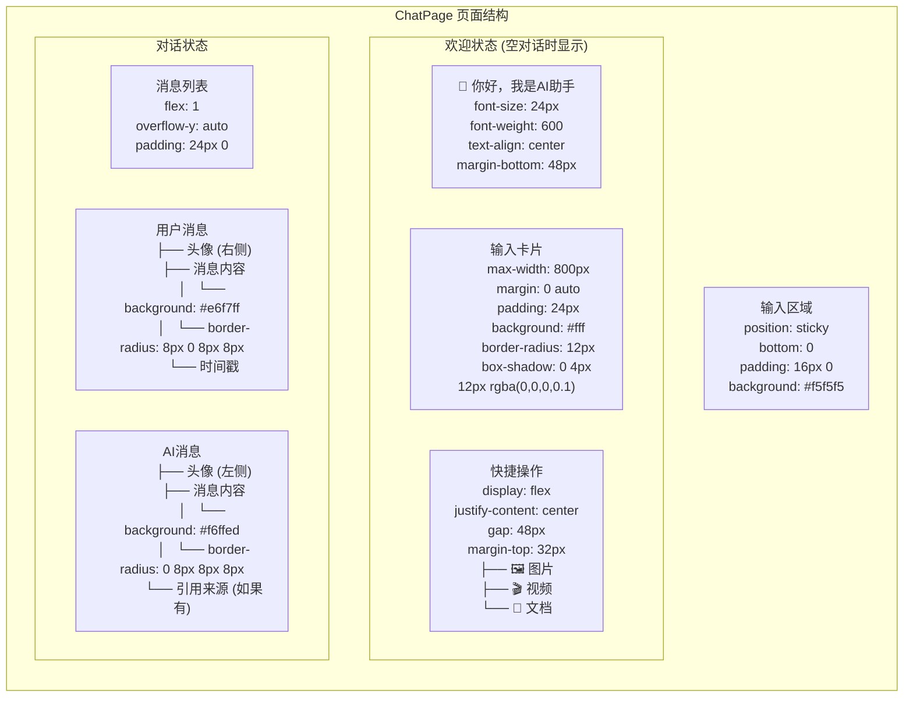
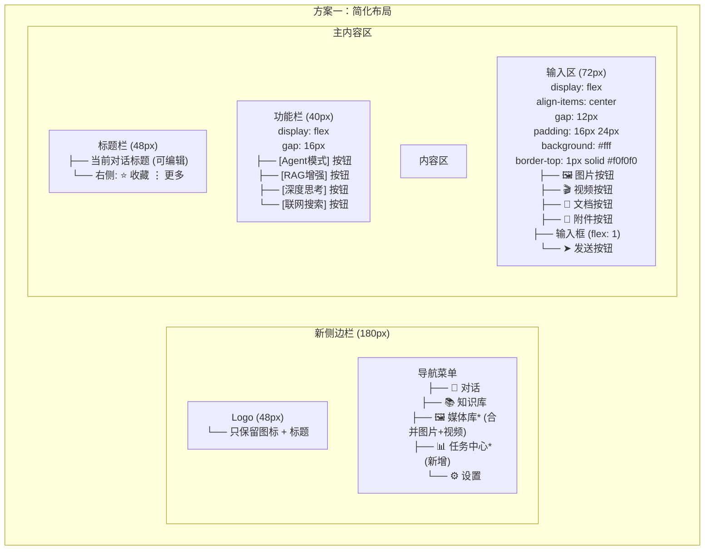
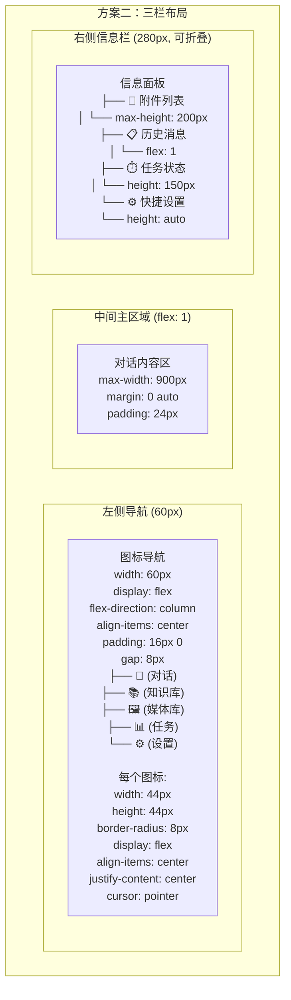
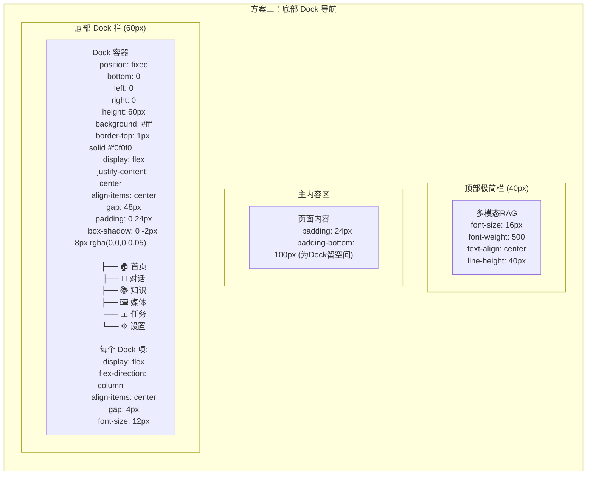
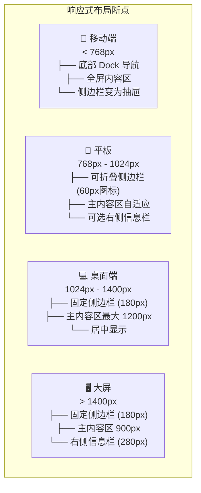

# 多模态RAG系统 - 界面重新布局方案

## 当前界面结构

### 整体布局



---

## 当前各区域详细结构

### 1. Sidebar 侧边栏 (200px)



### 2. Header 顶部栏 (64px)



### 3. ChatPage 对话页面



---

## 重新布局方案

### 方案一：简化布局（推荐）



**CSS 关键样式：**

```css
/* 新侧边栏 */
.new-sidebar {
  width: 180px;
  background: #001529;
  color: rgba(255,255,255,0.65);
}

.new-sidebar .menu-item {
  height: 40px;
  padding: 0 16px;
  display: flex;
  align-items: center;
  gap: 12px;
  cursor: pointer;
  transition: all 0.3s;
}

.new-sidebar .menu-item:hover {
  color: #fff;
  background: rgba(255,255,255,0.05);
}

.new-sidebar .menu-item.active {
  color: #fff;
  background: #1890ff;
}

/* 功能按钮组 */
.function-bar {
  display: flex;
  gap: 12px;
  padding: 8px 24px;
  background: #fff;
  border-bottom: 1px solid #f0f0f0;
}

.function-bar .func-btn {
  padding: 4px 12px;
  border-radius: 4px;
  border: 1px solid #d9d9d9;
  background: #fff;
  cursor: pointer;
  transition: all 0.3s;
}

.function-bar .func-btn.active {
  border-color: #1890ff;
  color: #1890ff;
  background: #e6f7ff;
}

/* 输入区域 */
.input-area {
  display: flex;
  align-items: center;
  gap: 12px;
  padding: 16px 24px;
  background: #fff;
  border-top: 1px solid #f0f0f0;
}

.input-area .file-btn {
  width: 36px;
  height: 36px;
  border-radius: 6px;
  border: 1px solid #d9d9d9;
  display: flex;
  align-items: center;
  justify-content: center;
  cursor: pointer;
  transition: all 0.3s;
}

.input-area .file-btn:hover {
  border-color: #1890ff;
  color: #1890ff;
}
```

---

### 方案二：三栏布局（适合宽屏 > 1400px）



**CSS 关键样式：**

```css
/* 三栏布局容器 */
.three-column-layout {
  display: flex;
  height: 100vh;
}

/* 左侧图标导航 */
.icon-nav {
  width: 60px;
  background: #001529;
  display: flex;
  flex-direction: column;
  align-items: center;
  padding: 16px 0;
  gap: 8px;
}

.icon-nav .nav-item {
  width: 44px;
  height: 44px;
  border-radius: 8px;
  display: flex;
  align-items: center;
  justify-content: center;
  color: rgba(255,255,255,0.65);
  cursor: pointer;
  transition: all 0.3s;
}

.icon-nav .nav-item:hover,
.icon-nav .nav-item.active {
  color: #fff;
  background: rgba(255,255,255,0.1);
}

/* 右侧信息栏 */
.info-panel {
  width: 280px;
  background: #fff;
  border-left: 1px solid #f0f0f0;
  display: flex;
  flex-direction: column;
  transition: width 0.3s;
}

.info-panel.collapsed {
  width: 0;
  overflow: hidden;
}

.info-panel .panel-section {
  padding: 16px;
  border-bottom: 1px solid #f0f0f0;
}

.info-panel .panel-section:last-child {
  border-bottom: none;
}
```

---

### 方案三：底部 Dock 导航（现代化）



**CSS 关键样式：**

```css
/* Dock 布局 */
.dock-layout {
  min-height: 100vh;
  padding-bottom: 60px; /* 为 Dock 留空间 */
}

/* 底部 Dock */
.dock-bar {
  position: fixed;
  bottom: 0;
  left: 0;
  right: 0;
  height: 60px;
  background: #fff;
  border-top: 1px solid #f0f0f0;
  display: flex;
  justify-content: center;
  align-items: center;
  gap: 48px;
  padding: 0 24px;
  box-shadow: 0 -2px 8px rgba(0,0,0,0.05);
}

.dock-bar .dock-item {
  display: flex;
  flex-direction: column;
  align-items: center;
  gap: 4px;
  padding: 8px 16px;
  color: rgba(0,0,0,0.45);
  cursor: pointer;
  transition: all 0.3s;
}

.dock-bar .dock-item:hover,
.dock-bar .dock-item.active {
  color: #1890ff;
}

.dock-bar .dock-item .icon {
  font-size: 20px;
}

.dock-bar .dock-item .label {
  font-size: 12px;
}
```

---

## 响应式断点设计



**响应式 CSS：**

```css
/* 移动端 */
@media (max-width: 768px) {
  .sidebar {
    transform: translateX(-100%);
    transition: transform 0.3s;
  }
  
  .sidebar.open {
    transform: translateX(0);
  }
  
  .main-content {
    margin-left: 0;
  }
  
  .dock-bar {
    display: flex; /* 显示底部导航 */
  }
}

/* 平板 */
@media (min-width: 768px) and (max-width: 1024px) {
  .sidebar {
    width: 60px; /* 只显示图标 */
  }
  
  .sidebar .menu-text {
    display: none;
  }
  
  .main-content {
    margin-left: 60px;
  }
}

/* 桌面端 */
@media (min-width: 1024px) {
  .sidebar {
    width: 180px;
  }
  
  .main-content {
    margin-left: 180px;
  }
  
  .content-wrapper {
    max-width: 1200px;
    margin: 0 auto;
  }
}

/* 大屏 */
@media (min-width: 1400px) {
  .three-column .info-panel {
    display: flex; /* 显示右侧栏 */
  }
}
```

---

## 文件修改清单

| 优先级 | 文件 | 修改内容 | 预估工作量 |
|--------|------|----------|-----------|
| 🔴 高 | `Sidebar.tsx` | 简化导航结构，合并图片+视频 | 2h |
| 🔴 高 | `ChatPage.tsx` | 重新设计输入框区域 | 3h |
| 🔴 高 | `App.tsx` | 调整整体布局结构 | 2h |
| 🟡 中 | `UnifiedTaskMonitor.tsx` | 改为浮动组件或集成到侧边栏 | 2h |
| 🟡 中 | `DocumentsPage.tsx` | 优化文档展示 | 1h |
| 🟡 中 | `MediaLibraryPage.tsx` | 新建：合并图片+视频库 | 3h |
| 🟢 低 | `TaskCenterPage.tsx` | 新建：任务中心页面 | 2h |
| 🟢 低 | `responsive.css` | 新建：响应式样式文件 | 2h |

---

## 实施建议

### 第一阶段：基础布局调整
1. 修改 `Sidebar.tsx` - 简化导航
2. 修改 `ChatPage.tsx` - 优化输入区域
3. 调整 `App.tsx` - 整体布局

### 第二阶段：功能整合
1. 合并图片库和视频库为媒体库
2. 添加任务中心页面
3. 优化任务监控组件位置

### 第三阶段：响应式适配
1. 添加移动端适配
2. 添加平板适配
3. 测试各断点显示效果

---

*此文档包含详细的 CSS 样式和布局参数，可直接参考实现*
